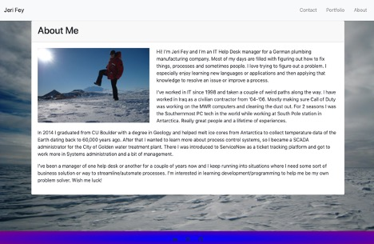
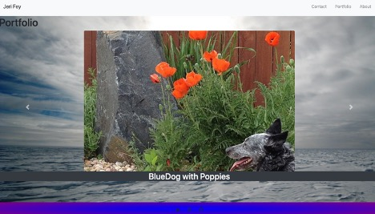
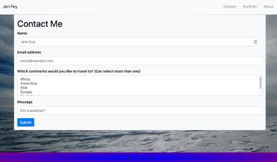

# ResponsivePortfolio
CSS &amp; Boostrap

Installation:
 - Basic html page with using Bootstrap css
 - Access from: https://jericfey.github.io/ResponsivePortfolio/

Summary: 
To apply responsive properties to a personal website that allows the end user to view the content in a similar manner independent of device type

Usage: 
 - Includes nav bar
 - Responsive images and layout
 - Using Bootstrap portfolio should minimize use of media queries
 - Use semantic HTML
 - Use Bootstrap grid system
 - Use Bootstrap for sticky footer

 Additions: 
  - I wanted to use a carousel feature on the Portfolio page and didn't want the images borded with a different color
  - I had some fun with a gradiant footer as well

<<<<<<< HEAD

=======

>>>>>>> 81781c8b02cc6b5c81f3f8230a4c81ccdd1b6248

    
    
